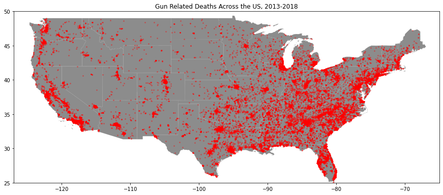

# Gun Violence in the United States, 2013-2018

## The Data

For this project, we'll be looking at gun related incidents in the United States during the years 2013-2018. The dataset contains over 230,000 incidents logged during this time period by the Gun Violence Archive (https://www.gunviolencearchive.org/). Every incident contains at least the following fields:
  - date 
  - state
  - number of people killed and injured
  - a list of incident characteristics (accidental shooting, domestic violence, drug involvement, etc.). 

Furthermore, the vast majority of incidents have more detailed information:
  - age and gender of the suspects and victims. 
  - longitude and latitude of the incident location
  - status of victims/suspects post-incident (arrested, unharmed, etc.)

The dataset can be found here: https://github.com/jamesqo/gun-violence-data

## Areas of Interest

1. How does the rate of gun violence vary geographically?

2. Do certain incident characteristics yield higher death rates?

3. What do the demographic breakdowns tell us about who are the most common victims and suspects of gun related incidents?

## Visualizing Gun-Related Deaths Geographically

Here we can see all gun incidents that resulted in death over the 5 year period:

As one would expect, gun incidents are clearly concentrated in the more populous areas of the United States. But it's a little hard to tell much more beyond that. So let's explore this relationship between population and gun-incidents. 

