# Gun Violence in the United States, 2013-2018

## The Data

For this project, we'll be looking at gun related incidents in the United States during the years 2013-2018. The dataset contains over 230,000 incidents logged during this time period by the Gun Violence Archive (https://www.gunviolencearchive.org/). Every incident contains at least the following fields:
  - date 
  - state
  - number of people killed and injured
  - a list of incident characteristics (accidental shooting, domestic violence, drug involvement, etc.). 

Furthermore, the vast majority of incidents have more detailed information:
  - age and gender of the suspects and victims. 
  - longitude and latitude of the incident location
  - status of victims/suspects post-incident (arrested, unharmed, etc.)

Quick Note: A portion of the incidents logged in the data set are classified as non-shooting incidents. Unless otherwise specified, we'll filtering out non-shooting related incidents.

The dataset can be found here: https://github.com/jamesqo/gun-violence-data

## Areas of Interest

1. How does the rate of gun violence vary geographically?

2. Do certain incident characteristics yield higher death rates?

3. What do the demographic breakdowns tell us about who are the most common victims and suspects of gun related incidents?

## Visualizing Gun-Related Deaths Geographically

Here we can see all gun incidents that resulted in death over the 5 year period:

As one would expect, gun incidents are clearly concentrated in the more populous areas of the United States. But it's a little hard to tell much more beyond that. So let's explore this relationship between population and gun-incidents. 

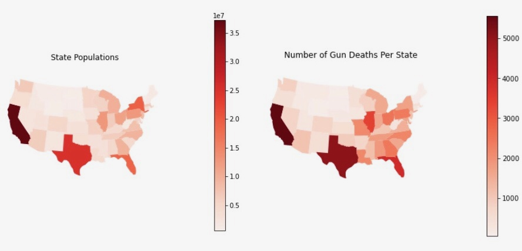

Much of the map seems unchanged, but we see some shifting here, particularly in the Southeastern US. Let's see if we can explore this difference with a bit more statistical rigor.

### Hypothesis Test: Are gun-related deaths directly proportional to a state's population size?
  - Null Hypothesis: The number of gun-related deaths is directly proportional to its population size (i.e. if a state contains 10% of the US population, we would assume that state would see roughly 10% of the total gun-related deaths).
  - Alternative Hypothesis: Gun-related deaths are not directly proportional / cannot be sufficiently explained or predicted by population size.
 
 In order to test this hypothesis, we need to create a table that contains our observed and expected values for gun deaths:
 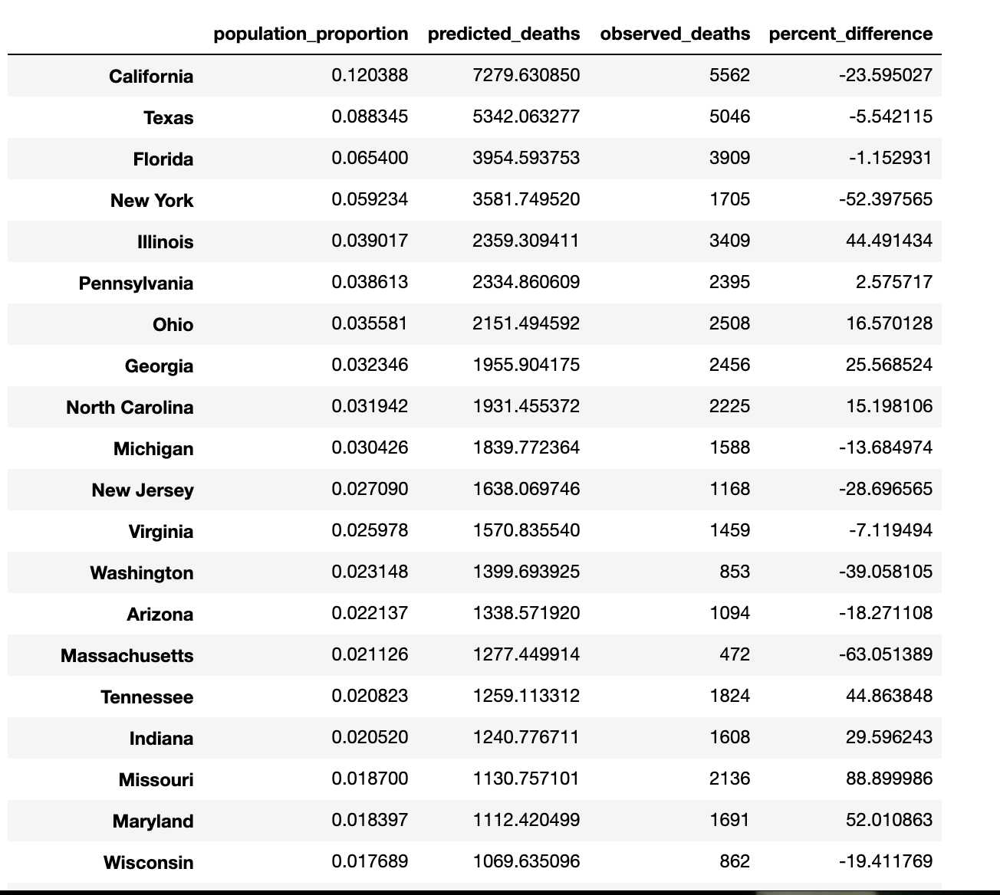
 
 Let's apply a chi-squared test using our 'observed_deaths' column as our observed frequencies and our 'predicted_deaths' column as our expected frequencies:
 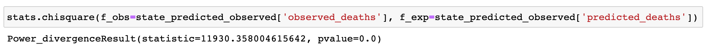
 
 With such a large test statistic, our p-value is virtually zero. This allows us to reject the null hypothesis that a state's population alone is a sufficient predictor of gun violence deaths. Here are a couple more geographical visualizations that may help further drive home this point:
 
 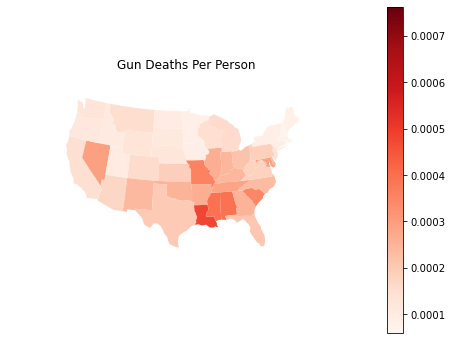
 
 Here's a quick look at the states with the highest and lowest differences between the number of deaths observed and the number of deaths predicted by population:
 
 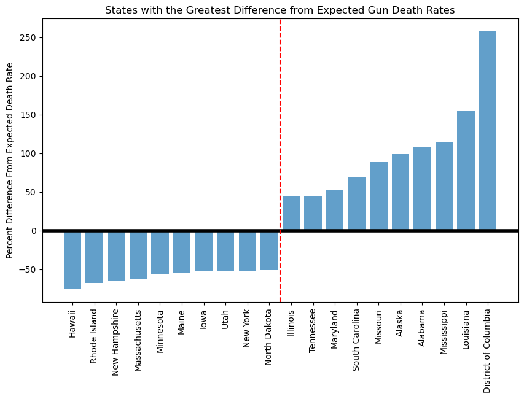
 
 And finally, a kernel density estimate plot that shows the country's biggest hotspots for gun-related deaths. Some of the clearest points of concentration occur in the Chicago, Baltimore/DC, and Atlanta areas:
 
 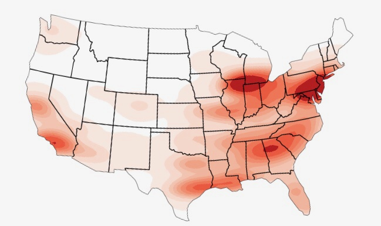
 
 
 ## How does the death rate change, if at all, when an assault weapon is used?
 
 One of the biggest issues surrounding gun legislation in the past few years is the regulation of assault weapons. Weapons like AR-15s, AK-47s, or any variant of assault rifle, at least anecdotally, seem to be involved in the deadliest, most horrific gun incidents in the country. So let's explore the topic with statistical testing to answer a very simple question: Are gun incidents more lethal when an assault weapon is used? 
 
 Let's first explore some basic death and casualty distributions:
 
 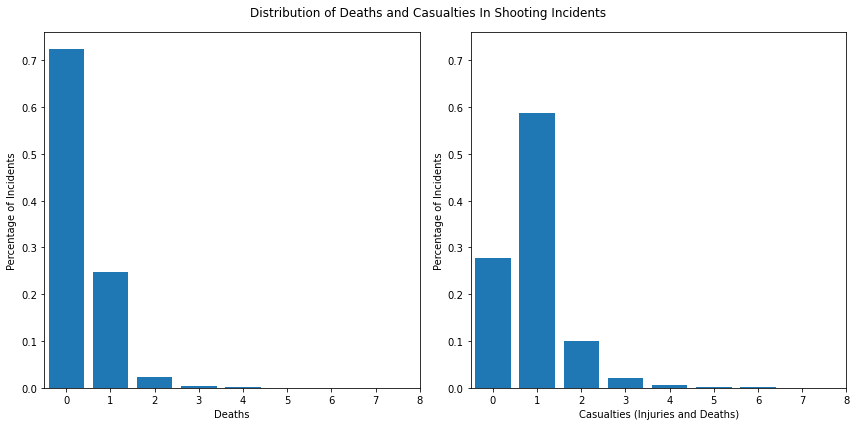
 
 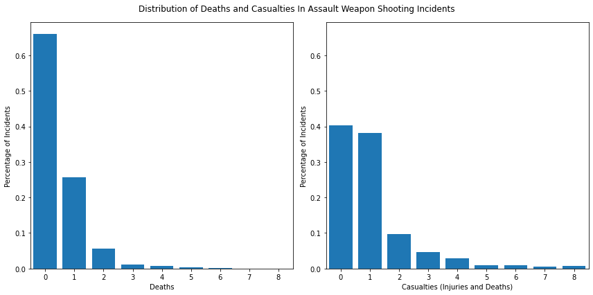
 
 At first glance, the distribution of death rate doesn't seem to vary all that much between shooting incidents and shooting incidents involving assault weapons. Casualty rates perhaps show a bit more rightward skew in assault weapon incidents. But let's focus on death rates here:
 
 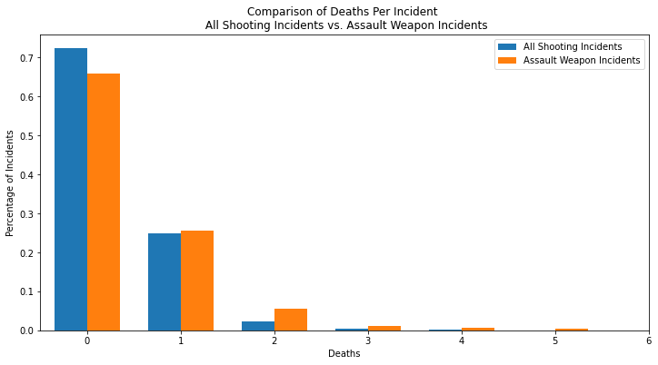
 
 Plotting them directly against each other seems to show that there is indeed a slight rightward skew to the distribution of assault weapon deaths. But maybe not as much as one might expect? Is it even statistically significant? Let's find out.
 
 ### Hypothesis Test:
  - Null Hypothesis: The mean death rate of assault weapon shooting incidents is the same as the mean death rate of all shooting incidents.
  - Alternative Hypothesis: The mean death rate of assault weapon shooting incidents is not the same as the mean death rate of all shooting incidents.
  - Significance Level: 0.05

Let's perform this test with an old-school Central Limit Theorem approach. We can assume that the distribution of sample means is going to be normally distributed with a sufficient sample size and number of samples, so let's make a normal distribution with our sample mean as the mean and our standard deviation being the standard error (sample standard deviation/square root of sample size). Let's first take a look at the distribution of death rate in all shooting incidents:

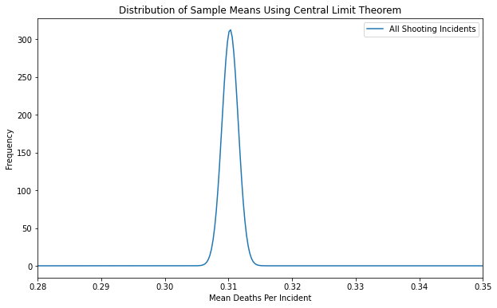

Here, we see a very tight spread centered at about .31 deaths per incident. It makes sense, given our very large sample size of over 190,000, that this distribution has a small standard deviation. Were we to be comparing this with a single sample mean, we would surpass our significance level and reject the null hypothesis if we observed a value greater than .312. Let's now see how this compares to our distribution for assault weapon incidents.

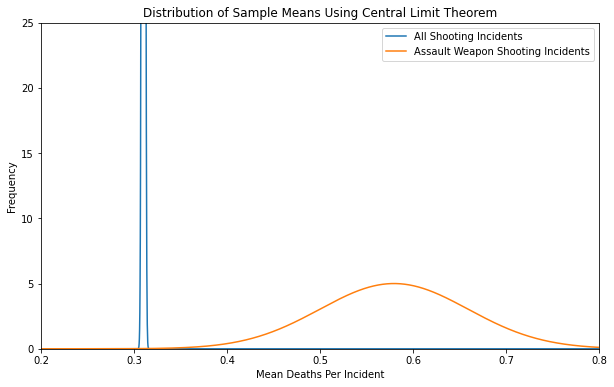

Here we see a pretty clear picture. The assault weapon distribution clearly has a larger spread, a combination of the fact that the sample size is much smaller (just under 800) and that assault weapon incidents may have naturally a higher degree of variability in death rates. Nevertheless, it's visually clear that these two distributions don't meaningfully overlap. But just for good measure, let's do a Welch's t-test:

With a p-value of well under a significance level of .05, we can reject the null hypothesis that the mean rate of death in assault weapon shooting incidents is the same as the mean rate of death across all shooting incidents. And while this may not be as drastic a difference as one might have expected, I would argue that any fraction of a human life (maybe anywhere between .1 and .5 deaths) is a significant difference. 

## Quantifying the risks to children and young adults as a result of accidental/negligent discharge

Another common area of concern when it comes to gun safety and legislation is the inherent risk posed to children. I became interested in exploring this facet of gun safety more closely when I first started plotting and comparing the demographic distributions of suspects and victims in gun-related incidents. First, let's take a look at the distribution across all incidents:

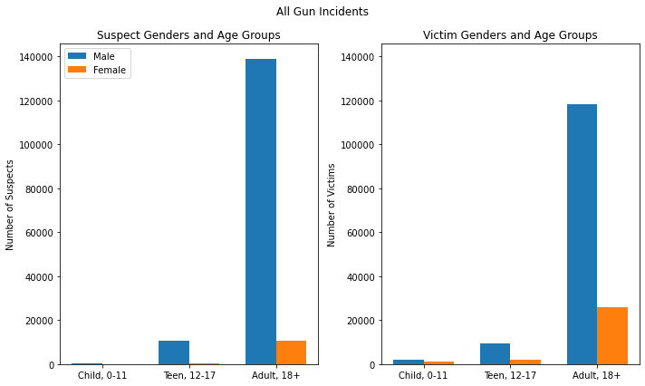

A pretty stark contrast here. Adult men are by far the most likely suspects in all gun-related incidents. We see a bit more of the other age and gender groups as victims, but adult men also seem likeliest to be the victims of gun violence. This general distribution shape holds true for a number of specific incident characteristics. But what happens when we look specifically at incidents involving accidental or negligent discharge?

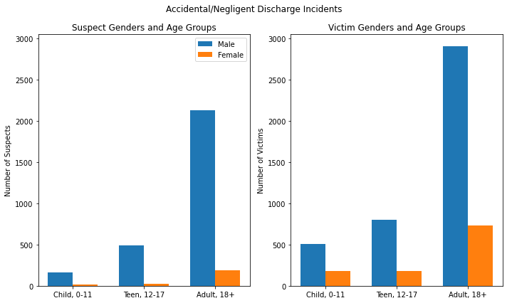

We see a pretty clear spike in the children and teen age groups, both as suspects and even more so as victims. But just how significant is this difference? Thinking about it in Bayesian terms, how much might we want to update our prior beliefs about the likelihood of different age groups being the victim if we now know that an incident involved accidental/negligent discharge? So let's do another test, but this time, we'll be constructing a confidence interval of the difference in sample proportions using bootstrapping!

### Hypothesis Test and Confidence Interval: 
  - Null Hypothesis: The sample proportion of underage victims (children and teens) of all gun incidents is equivalent to the sample proportion of underage victims of accidental/negligent discharge incidents.
  - Alternative Hypothesis: The proportion of underage victims of accidental/negligent discharges is higher than the proportion of underage victims of all gun incidents.

So, in order to test this hypothesis, we will take 2 bootstrap samples for each iteration, one from all gun incidents and another from only accidental/negligent discharge incidents. We'll find the proportion of underage victims in each sample, then record the difference in the proportions (all gun incidents - accidental/negligent discharge incidents). Iterate through this process 1000 times, and this is the distribution we find:

Null Hypothesis: p2 - p1 = 0

Alternative Hypothesis: p2 - p1 > 0

Significance Level = 0.05

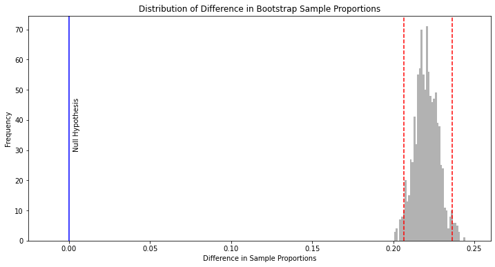

As we can see, the null hypothesis of a mean difference of 0 is nowhere near our sampling distribution. In fact, we can say with 95% confidence that the true difference in proportions between these populations is between .206 and .236. So, the takeaway here is that, if we are told that a gun incident is an accidental/negligent discharge, the probability that the victim is underage increases by at least 20%. 

## Future avenues of exploration / Limitations

 - Want to delve deeper into the cities with the highest density of gun violence per capita and explore more about what's going on there. Maybe include controls/testing for differences in how law enforcement operates in these cities vs. other cities. 
